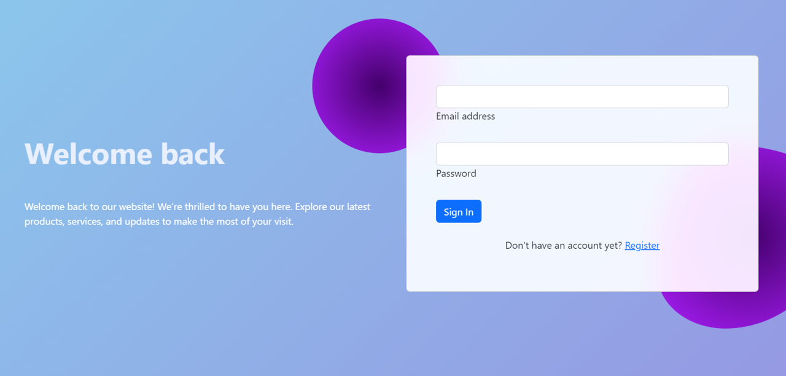

# Node.js Login and Authentication App

This is a Node.js application that provides user registration, login, and authentication functionality. Users can create accounts, log in, and access protected areas of the application.

## Features

- User Registration: Users can create accounts by providing their name, email, and password.
- User Login: Registered users can log in using their email and password.
- Password Hashing: User passwords are securely hashed before being stored in the database.
- Session Management: The application uses sessions to keep users authenticated between requests.
- Flash Messages: Informative flash messages are displayed for user feedback during registration and login.
- Bootstrap Styling: The application uses Bootstrap for responsive and visually appealing design.
- [Live Demo](https://kudoo39-authentication.glitch.me/login)

## Technologies Used

- Node.js/Express.js
- bcrypt

## What Can Improve

- User Profile Management
- Password Reset
- Email Verification
- Database Connection
